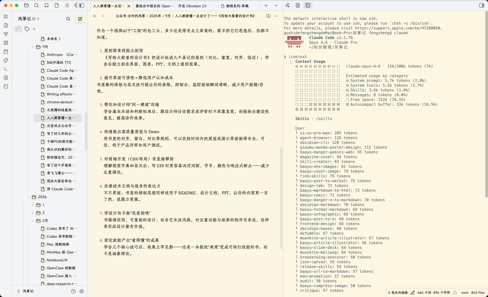
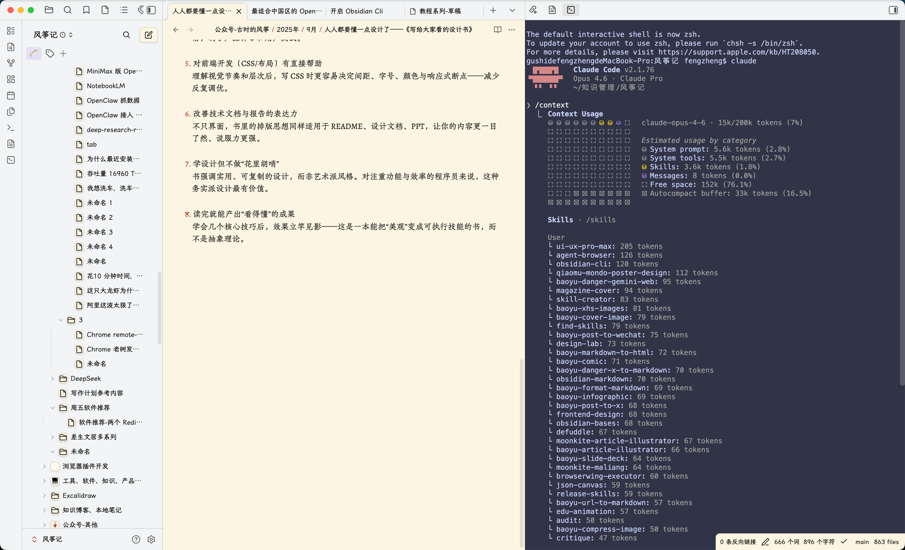
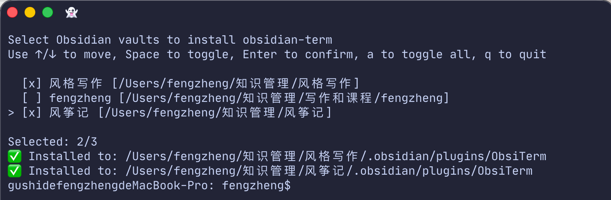
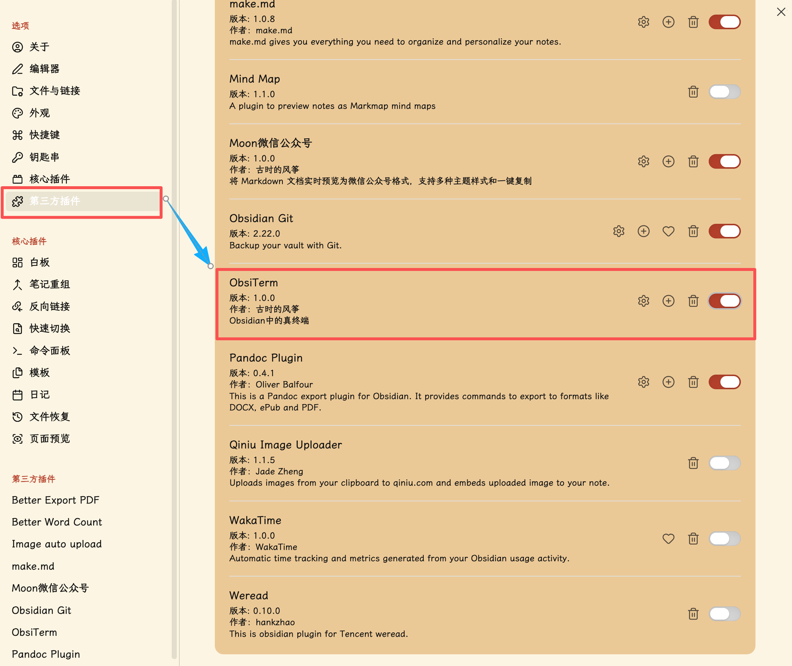
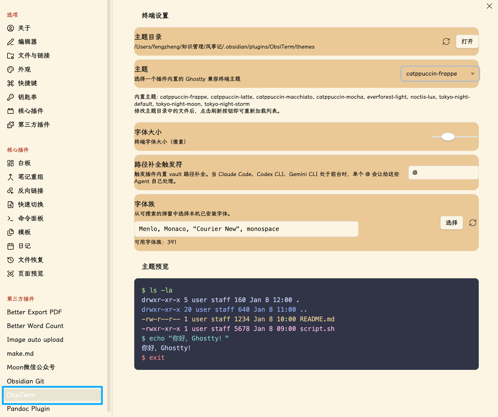
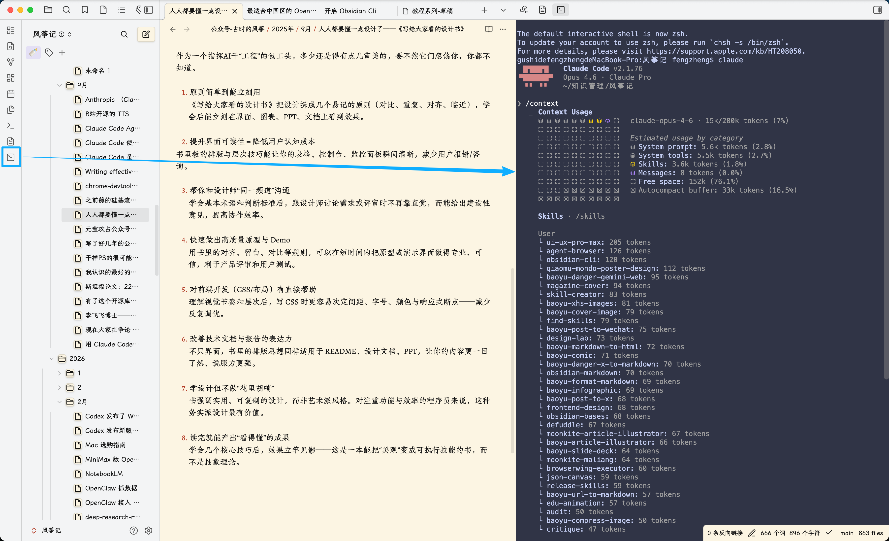

<div align="center">
  <h1>ObsiTerm</h1>
  <p><em> Obsidian 中的终端插件，方便在 Obsidian 中使用 Claude Code、Codex、Gemini Cli，以及其他命令行操作。</em></p>
  <p>
    
    
    
    <a href="https://github.com/huzhicheng"></a>
  </p>
  <p>
    
  </p>
</div>

## 功能说明

`ObsiTerm` 会在 Obsidian Desktop 的右侧边栏打开一个真实终端，你可以像使用其他终端一样使用它，例如 Claude Code、Codex、Gemini Cli，以及其他命令行操作。

## 特性

- 融合在 Obsidian 中的终端，可直接在 Obsidian 中使用 Claude Code、Codex、Gemini Cli 等，达到实时交互的效果。
- 完美兼容 Ghostty 终端主题，可以将 Ghostty 的主题文件直接复制到 themes 目录下（在设置页面可直接打开），然后通过设置中的主题选项进行切换。
- 内置 9 款主题

<table padding="0">
  <tr>
    <td align="center"><b>Light Theme</b></td>
    <td align="center"><b>Dark Theme</b></td>
  </tr>
  <tr>
    <td align="center">
      
    </td>
    <td align="center">
      
    </td>
  </tr>
</table>


- 支持@符号搜索文件，同时不干扰 Claude Code、Codex、Gemini Cli的原生指令
- 可配置字体、字号和文件路径补全触发符
- 支持大块文本折叠粘贴，也支持把图片粘贴为临时文件路径，类似 Claude Code 效果

## 使用

### 安装

到 [Releases](https://github.com/huzhicheng/ObsiTerm/releases) 下载对应系统的安装包（目前只有 MacOS）。

#### 自动安装
解压安装包，进入目录

```bash
chmod +x install.sh
./install.sh
```
会自动找到当前电脑上 Obsidian Vault 并列出，通过空格键选择一个或多个，然后按回车键安装。

<p>
    
  </p>

#### 手动安装

下载压缩包，解压后将 ObsiTerm 目录拷贝到 Vault 对应的 .obsidian/plugins/目录下。

### 开启和设置

在 Obsidian 设置中，找到第三方插件，找到 ObsiTerm，点击开启。


<p>
    
  </p>


在设置界面，可以设置主题、字号、字体、自动补全触发符等。

<p>
    
  </p>

### 打开终端

点击左侧边栏图标`New Terminal`，即可打开一个终端。

<p>
    
  </p>


### `@` 自动补全


1. 输入 `@`
2. 继续输入关键字
3. 用 `↑` / `↓` 选择
4. 按 `Tab` 或 `Enter` 确认
5. 按 `Esc` 取消

选中的项目会直接插入为绝对路径。

## 设置

可配置项包括：

- 主题
- 重新加载主题
- 字号
- 字体
- 自动补全触发符

主题文件位于 `themes/`。

## 许可证

MIT
